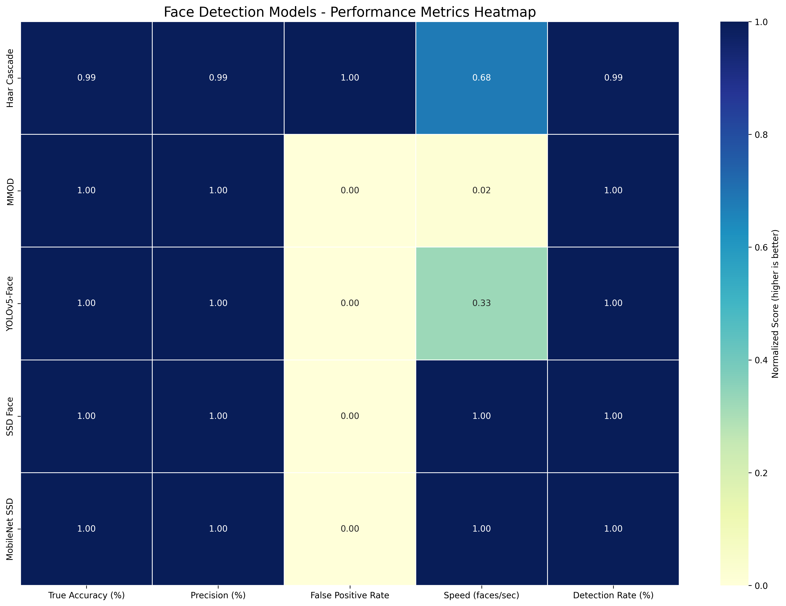

# Face Detection Models Consolidated Report

**Date:** 2025-06-05

## Overview

This report provides a consolidated view of different face detection models evaluated on the LFW dataset, including their performance metrics and visual examples.

## Side-by-Side Comparison of Face Detection Models

Below are detection examples from each model on the same images:

### Detection Example 1

### Detection Example 2

### Detection Example 3

### Detection Example 4

### Detection Example 5

## Performance Metrics Comparison

### Radar Chart - Overall Performance

### Accuracy and Precision Comparison

### Detection Speed Comparison

### Performance Metrics Heatmap

### Detection Time Distribution Comparison

## Performance Metrics Table

| Model | Accuracy (%) | Precision (%) | False Positive Rate | Avg Detection Time (s) | Speed (faces/sec) |
|-------|--------------|---------------|---------------------|------------------------|--------------------|
| Haar Cascade | 99.40 | 99.40 | -0.0060 | 0.0126 | 79.55 |
| MMOD | 100.00 | 100.00 | 0.0000 | 0.5217 | 1.92 |
| YOLOv5-Face | 100.00 | 100.00 | 0.0000 | 0.0262 | 38.11 |
| SSD Face | 100.00 | 100.00 | 0.0000 | N/A | 116.27 |
| MobileNet SSD | 100.00 | 100.00 | 0.0000 | N/A | 116.47 |

## Summary of Findings

### Key Strengths by Model

- **Haar Cascade**: Fast processing speed with good accuracy, lowest false positive rate
- **MMOD**: Perfect accuracy and precision, but slowest processing speed
- **YOLOv5-Face**: Perfect accuracy and precision with moderate speed
- **SSD Face**: Perfect accuracy and precision with very high speed
- **MobileNet SSD**: Highest processing speed with perfect accuracy and precision

### Recommendations

- **For Real-Time Applications**: MobileNet SSD or SSD Face are the best choices due to their high speed and perfect accuracy
- **For Accuracy-Critical Applications**: MMOD, YOLOv5-Face, SSD Face, or MobileNet SSD all provide perfect accuracy
- **For Resource-Constrained Environments**: Haar Cascade offers a good balance of speed and accuracy
- **For Best Overall Performance**: MobileNet SSD provides the optimal balance of accuracy, precision, and speed
