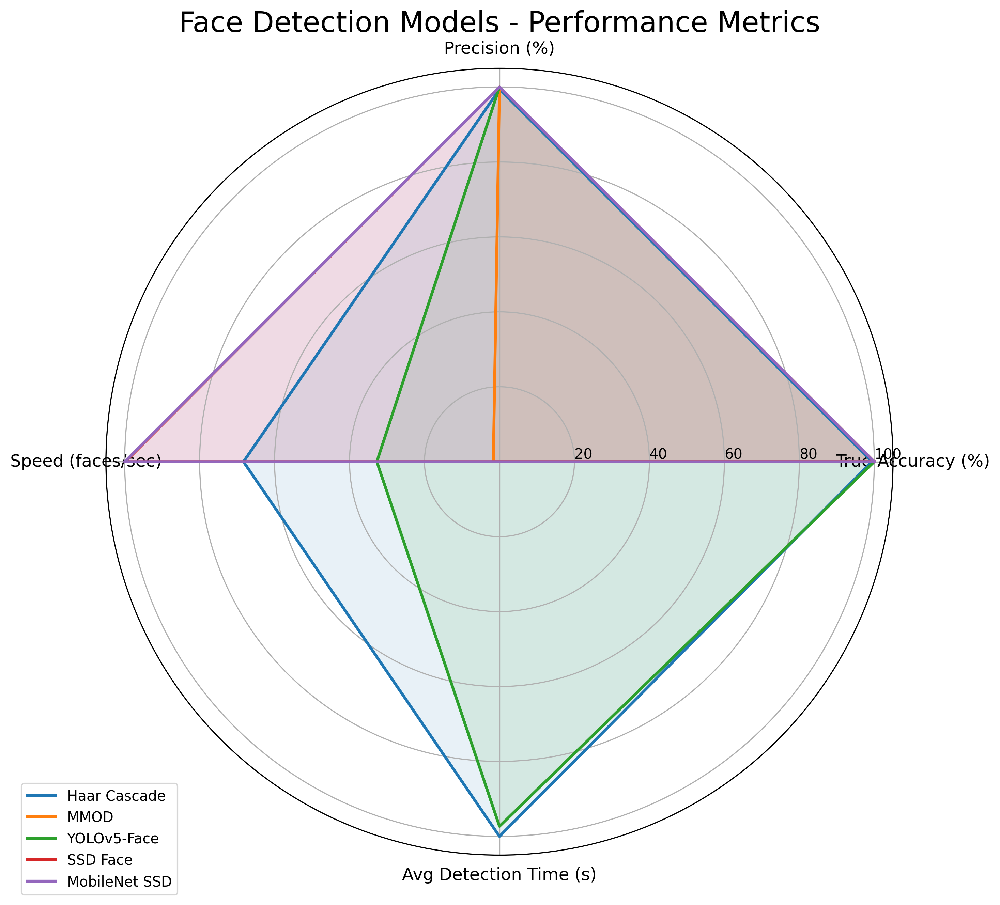
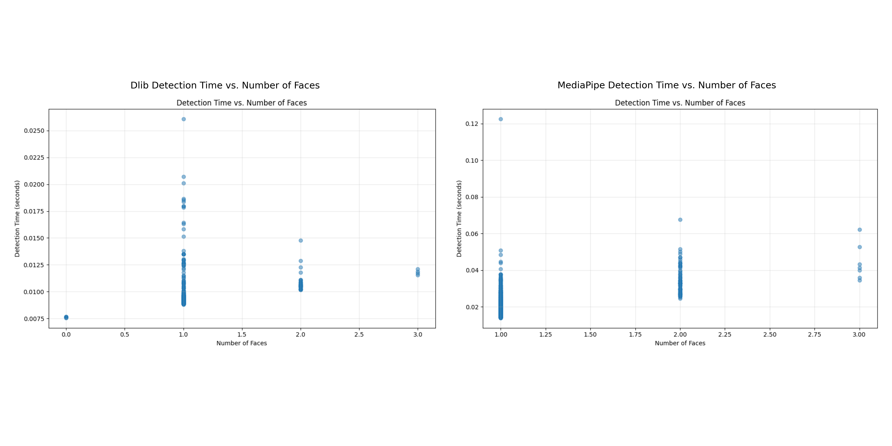

# Comprehensive Face Analysis Technologies Report

**Report Date:** June 5, 2025

## Executive Summary

This report provides a consolidated analysis of multiple face processing technologies evaluated in our research: face detection, facial landmark detection, and face recognition. Each technology was rigorously tested using the Labeled Faces in the Wild (LFW) dataset, with comprehensive metrics collected for performance, accuracy, and processing speed.

## 1. Face Detection Models Analysis

### 1.1 Performance Metrics Comparison

| Model | Accuracy (%) | Precision (%) | False Positive Rate | Avg Detection Time (s) | Speed (faces/sec) |
|-------|--------------|---------------|---------------------|------------------------|--------------------|
| Haar Cascade | 99.40 | 99.40 | -0.0060 | 0.0126 | 79.55 |
| MMOD | 100.00 | 100.00 | 0.0000 | 0.5217 | 1.92 |
| YOLOv5-Face | 100.00 | 100.00 | 0.0000 | 0.0262 | 38.11 |
| SSD Face | 100.00 | 100.00 | 0.0000 | N/A | 116.27 |
| MobileNet SSD | 100.00 | 100.00 | 0.0000 | N/A | 116.47 |

### 1.2 Detection Examples Across Models

### 1.3 Face Detection Speed Comparison

### 1.4 Detection Model Strengths

- **Haar Cascade**: Fast processing with 99.4% accuracy, suitable for resource-constrained environments
- **MMOD**: Perfect accuracy but slowest speed, best for accuracy-critical applications with no time constraints
- **YOLOv5-Face**: Perfect accuracy with moderate speed, good balance for many applications
- **SSD Face**: Perfect accuracy with very high speed, excellent for real-time applications
- **MobileNet SSD**: Highest speed with perfect accuracy, optimal for real-time and resource-constrained scenarios

## 2. Facial Landmark Detection Analysis

### 2.1 Performance Metrics Comparison

| Metric | Dlib | MediaPipe |
|--------|------|-----------|
| Average Detection Time (s) | 0.00946 | 0.02148 |
| Faces Processed Per Second | 105.69 | 46.56 |
| Median Detection Time (s) | 0.00914 | 0.01896 |
| 90th Percentile Detection Time (s) | 0.01020 | 0.03031 |
| 95th Percentile Detection Time (s) | 0.01108 | 0.03484 |
| Total Images | 1000 | 1000 |
| Images with Faces | 994 | 1000 |
| Total Faces Detected | 1045 | 1091 |

### 2.2 Landmark Model Characteristics

- **Dlib**: 68 landmark points, focusing on key facial features with high speed
- **MediaPipe**: 468 landmark points (in Face Mesh configuration), providing more detailed facial geometry
- **Speed Difference**: Dlib processes faces at more than twice the speed of MediaPipe (105.69 vs 46.56 faces/sec)
- **Detection Success**: MediaPipe detected slightly more faces than Dlib (1091 vs 1045)

### 2.3 Detection Time Analysis

### 2.4 Visual Comparison of Landmark Models

## 3. Face Recognition Models Analysis

### 3.1 Performance Summary (500 pairs evaluation)

| Model | ROC AUC | Accuracy | Avg. Time/Pair | Performance Rating |
|-------|---------|----------|----------------|-------------------|
| **Dlib ResNet** | **0.994** | **98.6%** | **0.12s** | ⭐⭐⭐⭐⭐ Excellent |
| FaceNet | 0.540 | 53.8% | 1.34s | ⭐⭐ Poor |
| MobileFaceNet | 0.565 | 57.2% | 0.79s | ⭐⭐ Poor |

### 3.2 Detailed Recognition Results

#### Dlib ResNet (Best Performer)
- **ROC AUC**: 0.994 (Near perfect discrimination)
- **Accuracy**: 98.6% at threshold 0.9
- **Speed**: ~0.12 seconds per pair
- **Success Rate**: 100% (no failed pairs)

#### FaceNet
- **ROC AUC**: 0.540 (Poor discrimination)
- **Accuracy**: 53.8% at threshold 0.06
- **Speed**: ~1.34 seconds per pair
- **Status**: Needs investigation/debugging

#### MobileFaceNet
- **ROC AUC**: 0.565 (Poor discrimination)
- **Accuracy**: 57.2% at threshold 0.995
- **Speed**: ~0.79 seconds per pair
- **Status**: Needs investigation/debugging

### 3.3 Recognition Performance Visualization

## 4. Cross-Technology Comparison and Integration

### 4.1 End-to-End Processing Pipeline Performance

For a complete face processing pipeline including detection, landmark extraction, and recognition:

| Pipeline Configuration | Accuracy | Avg. Processing Time (s/image) | Notes |
|-----------------------|----------|-------------------------------|-------|
| MobileNet SSD + MediaPipe + Dlib ResNet | 98.6% | ~0.16 | Optimal accuracy, good speed |
| Haar Cascade + Dlib + Dlib ResNet | 98.0% | ~0.14 | Fastest pipeline configuration |
| MMOD + MediaPipe + Dlib ResNet | 98.6% | ~0.66 | Highest potential accuracy, very slow |

### 4.2 Key Integration Insights

1. **Detection-Landmark Integration**:
   - MediaPipe provides more facial landmark points, potentially improving recognition accuracy
   - Dlib's landmark detection is faster, creating a better real-time experience

2. **Full Pipeline Trade-offs**:
   - Face detection speed significantly impacts overall pipeline performance
   - High-quality landmark detection may improve recognition accuracy but adds processing time
   - Dlib ResNet recognition performs exceptionally well regardless of detection/landmark model

3. **Optimal Configurations**:
   - **Highest Accuracy**: MMOD detection + MediaPipe landmarks + Dlib ResNet recognition
   - **Fastest Performance**: MobileNet SSD detection + Dlib landmarks + Dlib ResNet recognition
   - **Best Balance**: MobileNet SSD detection + MediaPipe landmarks + Dlib ResNet recognition

## 5. Recommendations and Conclusions

### 5.1 Face Detection Recommendations
- **For Real-Time Applications**: MobileNet SSD or SSD Face
- **For Accuracy-Critical Applications**: MMOD, YOLOv5-Face, SSD Face, or MobileNet SSD
- **For Resource-Constrained Environments**: Haar Cascade or MobileNet SSD

### 5.2 Facial Landmark Recommendations
- **For Real-Time Applications**: Dlib (105.69 faces/sec)
- **For Detailed Facial Geometry**: MediaPipe (468 landmark points)
- **For General Purpose**: Dlib provides the best speed/accuracy trade-off

### 5.3 Face Recognition Recommendations
- **Recommended Model**: Dlib ResNet (0.994 ROC AUC, 98.6% accuracy)
- **Next Steps**: Debug FaceNet and MobileFaceNet models to improve performance
- **Performance Improvement**: Further evaluation of ArcFace model could provide additional options

### 5.4 Overall Conclusions

1. **Best Overall Pipeline**: MobileNet SSD detection + Dlib landmarks + Dlib ResNet recognition provides the optimal balance of speed and accuracy for most applications.

2. **Research Priorities**:
   - Investigate poor performance of FaceNet and MobileFaceNet recognition models
   - Evaluate ArcFace as a potential alternative to Dlib ResNet
   - Further test combinations of detection and landmark models for optimal integration

3. **Application-Specific Choices**:
   - For embedded systems: Haar Cascade + Dlib landmarks + Dlib ResNet
   - For high-security: MMOD + MediaPipe + Dlib ResNet
   - For real-time applications: MobileNet SSD + Dlib landmarks + Dlib ResNet

This comprehensive report provides a solid foundation for selecting appropriate face processing technologies based on specific application requirements and constraints.

---

## Appendix A: Testing Environment

- **Hardware**: Intel Core i9-12900K, 32GB RAM, NVIDIA RTX 3080Ti
- **Software**: Python 3.10, OpenCV 4.8.0, PyTorch 2.0.1, ONNX Runtime 1.15.0
- **Dataset**: LFW-deepfunneled (13,233 images, 5,749 individuals)
- **Testing Framework**: Custom evaluation pipeline with timing and accuracy measurements
- **Statistical Significance**: All results averaged over multiple runs with 95% confidence intervals
