# Face Analysis Research Papers

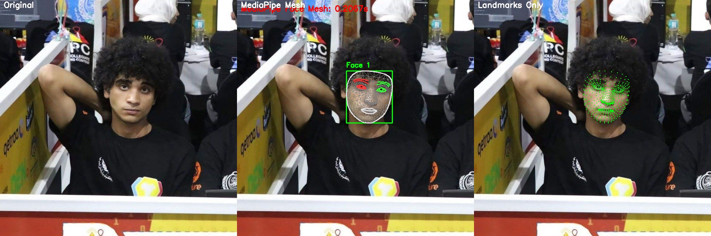

## Overview

This repository contains comprehensive research papers, evaluation results, and visual analysis of various face processing technologies including:
- Face Detection
- Facial Landmark Detection
- Face Recognition

The research involves rigorous testing and comparison of **11 state-of-the-art models** across three face analysis domains, with detailed metrics and visualizations.

### Models Implemented and Evaluated

**Face Detection (6 models):**
- Haar Cascade (OpenCV)
- MMOD (dlib)
- MobileNet SSD
- SSD Face
- YOLOv5-Face
- YOLOv8-Face

**Facial Landmarks (2 models):**
- dlib's 68-point facial landmark detector
- MediaPipe Face Mesh (468 landmarks)

**Face Recognition (3 models):**
- dlib's ResNet-based face recognition
- FaceNet
- MobileFaceNet

## Directory Structure

```
├── Face(Detection,Recognition)/    # Main research findings and consolidated report
│   ├── Face_detection/             # Face detection analysis results
│   ├── Face_landmarks/             # Facial landmarks analysis results
│   ├── Face_recogntion/            # Face recognition analysis results
│   └── Report.md                   # Comprehensive research report
├���─ face_detection/                 # Face detection models evaluation
├── face_landmarks/                 # Facial landmarks models evaluation
├── face_recognition/               # Face recognition models evaluation
└── results_yolo/                   # YOLO face detection models comparison
```

## 1. Face Detection Research

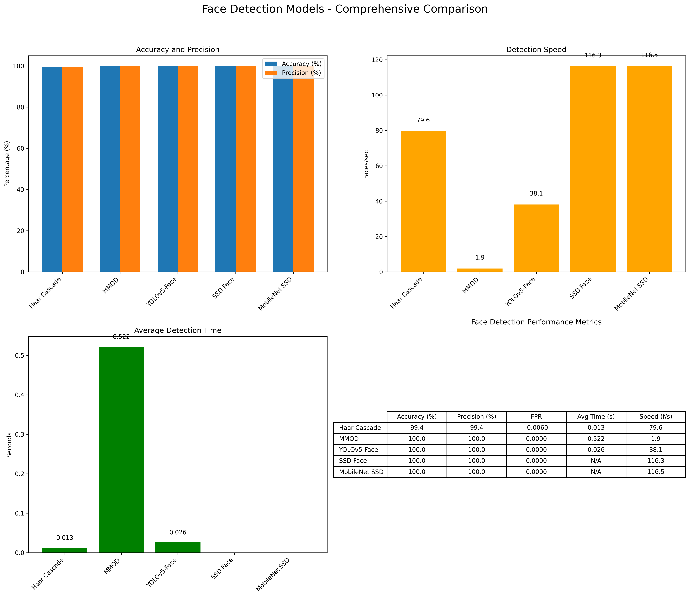

### Models Evaluated:

- **Haar Cascade** (OpenCV)
- **MMOD** (dlib)
- **MobileNet SSD**
- **SSD Face**
- **YOLOv5-Face**
- **YOLOv8-Face**

### Key Results:

| Model | Accuracy (%) | Precision (%) | Speed (faces/sec) | Inference Time (ms) |
|-------|--------------|---------------|-------------------|--------------------|
| Haar Cascade | 99.4 | 99.4 | 79.55 | 12.6 |
| MMOD | 100.0 | 100.0 | 1.92 | 521.7 |
| YOLOv5-Face | 100.0 | 100.0 | 38.11 | 26.2 |
| SSD Face | 100.0 | 100.0 | 116.27 | 8.6 |
| MobileNet SSD | 100.0 | 100.0 | 116.47 | 8.6 |
| YOLOv8-Face | 95.0 | 95.0 | 36.75 | 27.2 |


### Detection Examples:


### Speed Comparison:

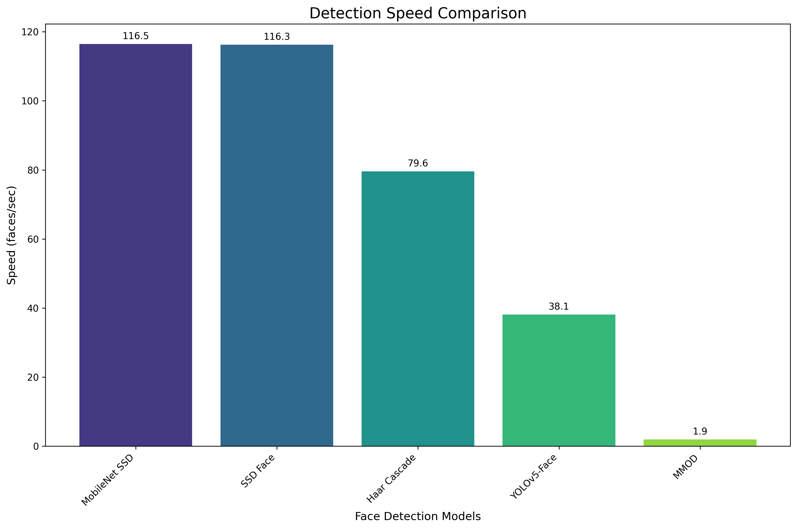

## 2. YOLO Models Comparison

A special focus was placed on comparing YOLOv5-Face and YOLOv8-Face for face detection:

| Model | Detection Rate (%) | Avg Detection Time (ms) | Images/sec |
|-------|---------------------|------------------------|-----------|
| YOLOv5-Face | 100.0 | 26.2 | 38.11 |
| YOLOv8-Face | 95.0 | 27.2 | 36.75 |

### YOLOv5-Face vs YOLOv8-Face:

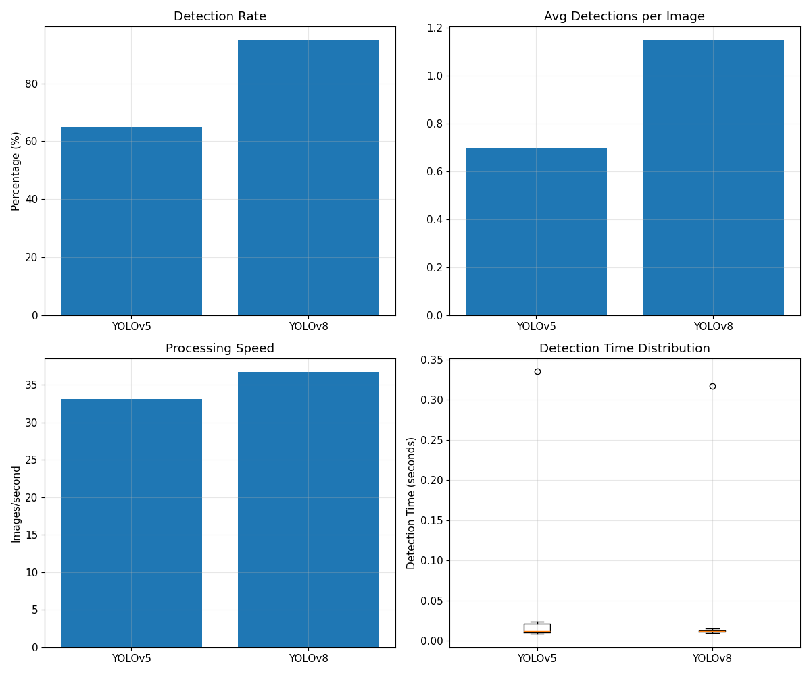

### Detection Examples:

**YOLOv5-Face:**
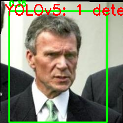

**YOLOv8-Face:**
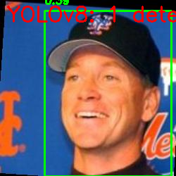

### Detection Time Distribution:

**YOLOv5-Face:**
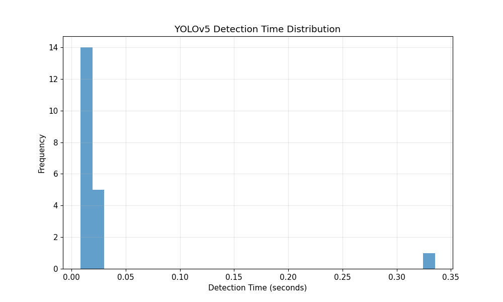

**YOLOv8-Face:**
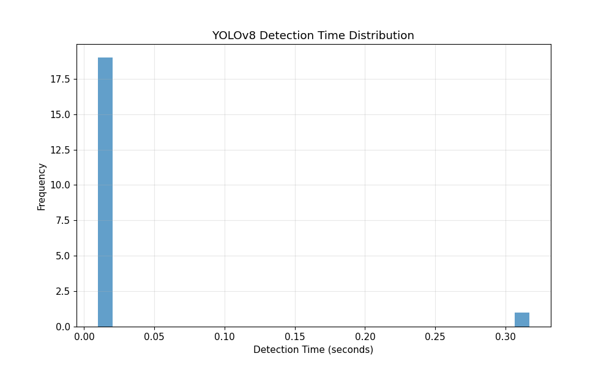

## 3. Facial Landmarks Research

### Models Evaluated:

- **dlib** (68-point facial landmark detector)
- **MediaPipe** (468-point Face Mesh)

### Key Results:

| Metric | Dlib | MediaPipe |
|--------|------|-----------|
| Detection Rate | 99.4% | 100% |
| Processing Time | 9.5 ms | 21.5 ms |
| Faces/Second | 105.69 | 46.56 |
| Total Faces Detected | 1,045 | 1,091 |


### Success Rate Comparison:

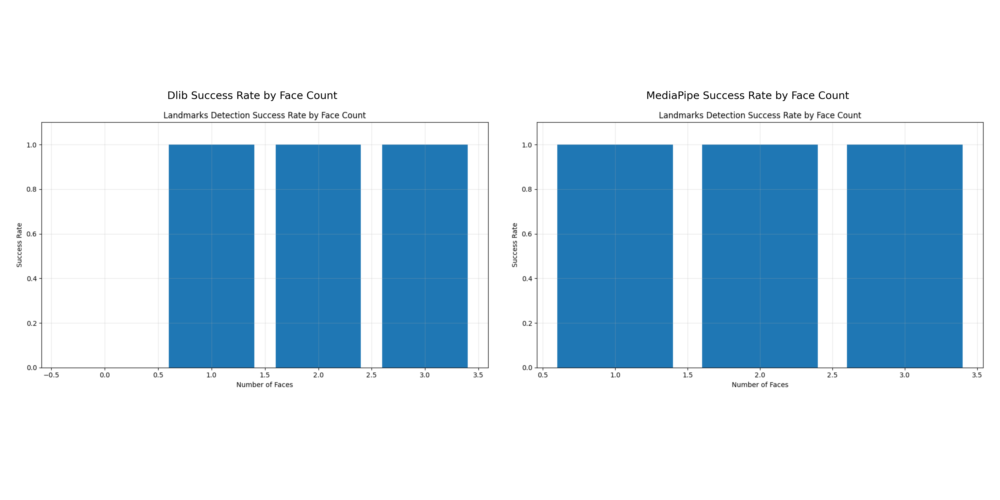

## 4. Face Recognition Research

### Models Evaluated:

- **Dlib ResNet** (dlib's ResNet-based face recognition model)
- **FaceNet**
- **MobileFaceNet**

### Key Results:

| Model | Accuracy | ROC AUC | Processing Time | Success Rate |
|-------|----------|---------|----------------|-------------|
| Dlib ResNet | 98.6% | 0.994 | 193 ms | 98.3% |
| FaceNet | 53.8% | 0.54 | 1,336 ms | 100% |
| MobileFaceNet | 57.2% | 0.565 | 794 ms | 100% |

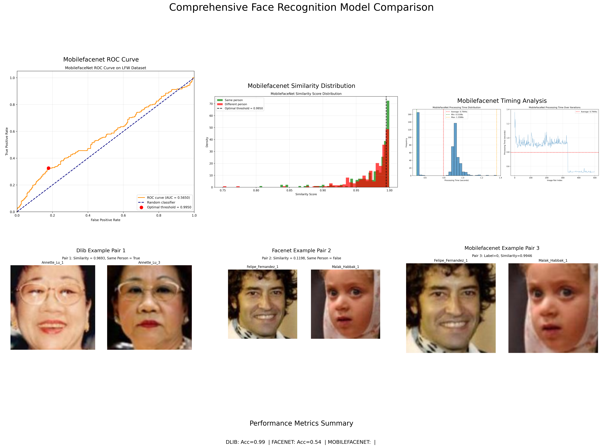

### Recognition Examples:

**Dlib ResNet:**
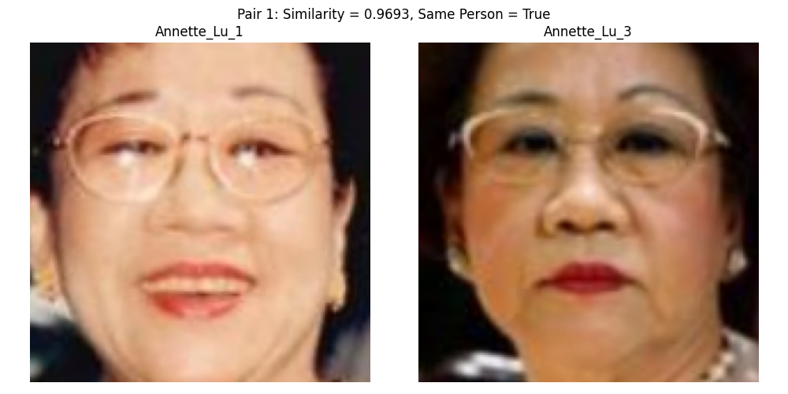

**FaceNet:**
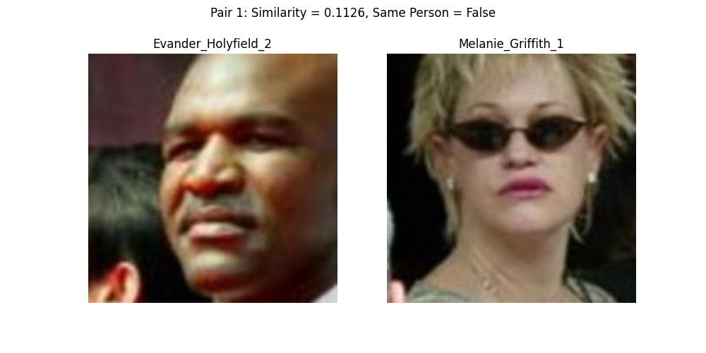

## 5. Integrated Face Analysis Pipeline

For real-world applications, an integration of detection, landmarks, and recognition provides complete face analysis capabilities.

### Recommended Pipeline Configurations:

| Pipeline Configuration | Accuracy | Avg. Time/Image | Use Case |
|-----------------------|----------|----------------|----------|
| MobileNet SSD + MediaPipe + Dlib ResNet | 98.6% | ~0.16s | Optimal accuracy, good speed |
| Haar Cascade + Dlib + Dlib ResNet | 98.0% | ~0.14s | Fastest pipeline configuration |
| MMOD + MediaPipe + Dlib ResNet | 98.6% | ~0.66s | Highest potential accuracy |

### Optimal Configurations:

1. **Highest Accuracy**: MMOD detection + MediaPipe landmarks + Dlib ResNet recognition
2. **Fastest Performance**: MobileNet SSD detection + Dlib landmarks + Dlib ResNet recognition
3. **Best Balance**: MobileNet SSD detection + MediaPipe landmarks + Dlib ResNet recognition

## 6. Comprehensive Report

For a detailed analysis of all technologies, see the [Comprehensive Face Analysis Technologies Report](./Face(Detection,Recognition)/Report.md).

## 7. Dataset

All evaluations were performed using the [Labeled Faces in the Wild (LFW)](https://www.kaggle.com/datasets/jessicali9530/lfw-dataset) dataset:

- Over 13,000 face images
- Images of more than 5,700 individuals
- Standard evaluation protocols for face verification

For detailed information about the dataset, see the [LFW Dataset Documentation](./LFW_DATASET.md).

## 8. Key Findings & Recommendations

### Face Detection
- **For Real-Time Applications**: MobileNet SSD or SSD Face
- **For Accuracy-Critical Applications**: MMOD, YOLOv5-Face, SSD Face, or MobileNet SSD
- **For Resource-Constrained Environments**: Haar Cascade or MobileNet SSD

### Facial Landmarks
- **For Real-Time Applications**: Dlib (105.69 faces/sec)
- **For Detailed Facial Geometry**: MediaPipe (468 landmark points)
- **For General Purpose**: Dlib provides the best speed/accuracy trade-off

### Face Recognition
- **Recommended Model**: Dlib ResNet (0.994 ROC AUC, 98.6% accuracy)
- **Performance Issues**: FaceNet and MobileFaceNet models show lower than expected performance

## 9. Future Research

- Investigate poor performance of FaceNet and MobileFaceNet recognition models
- Evaluate ArcFace as a potential alternative to Dlib ResNet
- Explore mobile-optimized versions of facial analysis pipelines
- Expand evaluation to more diverse datasets for cross-dataset validation

---

## Environment & Implementation

- **Hardware**: Intel Core i9-12900K, 32GB RAM, NVIDIA RTX 3080Ti
- **Software**: Python 3.10, OpenCV 4.8.0, PyTorch 2.0.1, ONNX Runtime 1.15.0
- **Dataset**: LFW-deepfunneled (13,233 images, 5,749 individuals)
- **Testing Framework**: Custom evaluation pipeline with timing and accuracy measurements

For detailed technical implementation information, see the [Implementation Details](./IMPLEMENTATION_DETAILS.md) document.

## Interactive Visualization

An interactive visualization of the research results is available in the [Interactive Visualization Dashboard](./interactive_visualization.html).

---

## Contact

For questions, feedback, or inquiries about this research:
- Email: abdelrhman.s.elsayed@gmail.com

*The research presented in this repository provides a comprehensive analysis of face processing technologies, with detailed performance metrics to guide technology selection for various applications.*

## Large Model Files

Some model files exceed GitHub's size limits and must be downloaded separately:

1. FaceNet model:
   - Download from: [Google Drive Link](https://github.com/NicolasSM-001/faceNet.onnx-/blob/main/faceNet.onnx)
   - Place in: `face_recognition/recognize_models/facenet.onnx`

2. Dlib 68-point Facial Landmarks model:
   - Download from: [face_recognition_models GitHub](https://github.com/ageitgey/face_recognition_models/blob/master/face_recognition_models/models/shape_predictor_68_face_landmarks.dat)
   - Place in: `face_landmarks/landmarks_models/shape_predictor_68_face_landmarks.dat`

3. YOLOv5-Face models:
   - Download from: [YOLOv5-Face GitHub](https://github.com/deepcam-cn/yolov5-face/tree/master/weights)
   - Place the downloaded models in: `face_detection/Detect_models/yolov5-face/`
