# Face Detection Models Comparison Report

**Date:** 2025-06-02 15:45:51

## Summary

This report compares the performance of different face detection models on the LFW dataset.

- **Best Accuracy:** MMOD (100.00%)
- **Best Precision:** MMOD (100.00%)
- **Lowest False Positive Rate:** Haar Cascade (-0.0060)
- **Best Speed:** MobileNet SSD (116.47 faces/sec)

## Comparison Table

|               |   True Accuracy (%) |   Precision (%) |   False Positive Rate |   Avg Detection Time (s) |   Speed (faces/sec) |   Detection Rate (%) |   Total Images |   Images with Faces |   Images without Faces |   Images with 1 Face |   Images with >1 Face |   Images with 0 Faces |   Total Faces Detected |   Avg Faces/Image |
|:--------------|--------------------:|----------------:|----------------------:|-------------------------:|--------------------:|---------------------:|---------------:|--------------------:|-----------------------:|---------------------:|----------------------:|----------------------:|-----------------------:|------------------:|
| Haar Cascade  |                99.4 |            99.4 |                -0.006 |                0.0125705 |            79.5512  |                 99.4 |           1000 |                 994 |                      6 |                  994 |                     0 |                     6 |                    994 |             0.994 |
| MMOD          |               100   |           100   |                 0     |                0.521725  |             1.91672 |                100   |           1000 |                1000 |                      0 |                 1000 |                     0 |                     0 |                   1000 |             1     |
| YOLOv5-Face   |               100   |           100   |                 0     |                0.0262408 |            38.1086  |                100   |           1000 |                1000 |                      0 |                 1000 |                     0 |                     0 |                   1000 |             1     |
| SSD Face      |               100   |           100   |                 0     |              nan         |           116.266   |                100   |           1000 |                1000 |                      0 |                 1000 |                     0 |                     0 |                    nan |           nan     |
| MobileNet SSD |               100   |           100   |                 0     |              nan         |           116.467   |                100   |           1000 |                1000 |                      0 |                 1000 |                     0 |                     0 |                    nan |           nan     |

## Comparison Graphs

### Accuracy Comparison

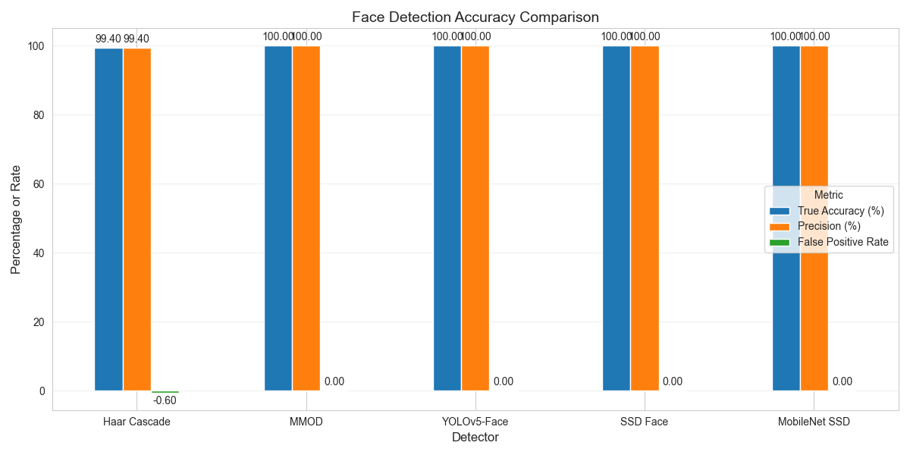

### Speed Comparison

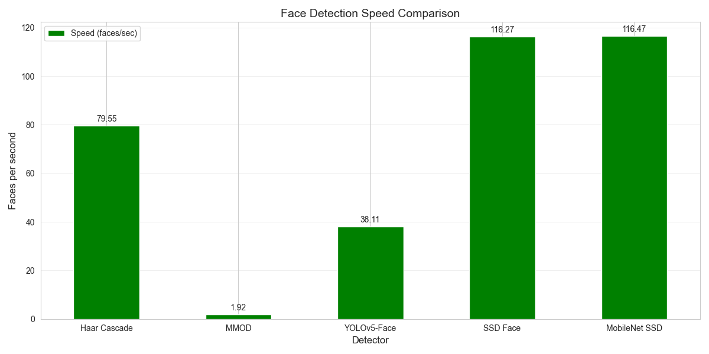

### Face Count Comparison

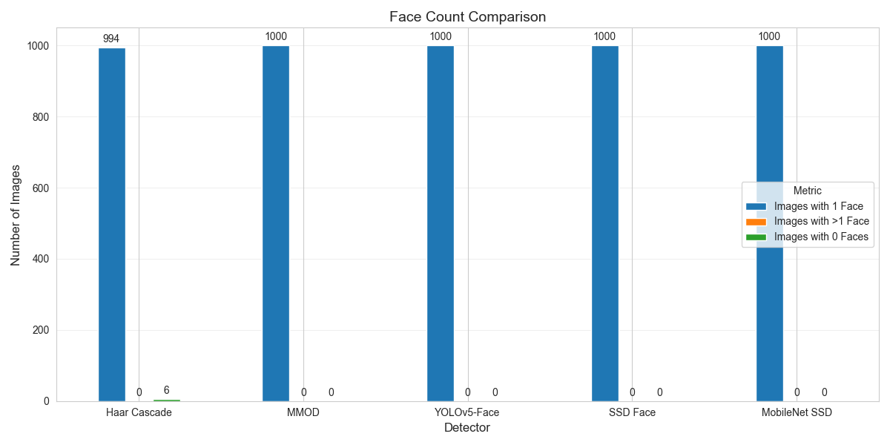

### Radar Chart Comparison

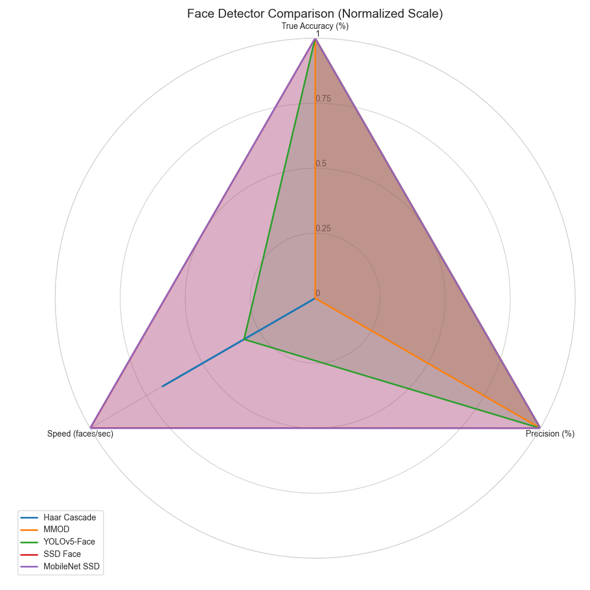

## Detailed Results

### Haar Cascade

#### Sample Detections

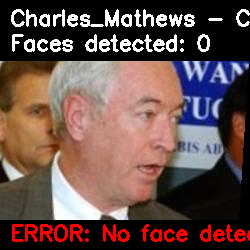

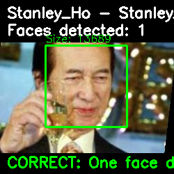


#### Console Output

```

- Average detection time: 0.0126 seconds per image
- Processing speed: 79.55 faces/second
- P50 (median) detection time: 0.0120 seconds
- P90 detection time: 0.0165 seconds
- P95 detection time: 0.0180 seconds
- P99 detection time: 0.0217 seconds

DETECTION ```

### MMOD

#### Sample Detections

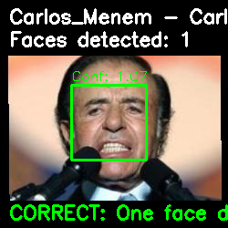

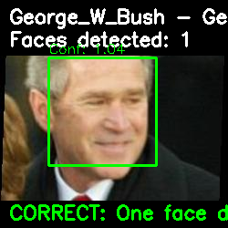

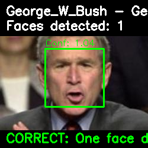

#### Console Output

```

- Average detection time: 0.5217 seconds per image
- Processing speed: 1.92 faces/second
- P50 (median) detection time: 0.5196 seconds
- P90 detection time: 0.5486 seconds
- P95 detection time: 0.5601 seconds
- P99 detection time: 0.5944 seconds

DETECTION ```

### YOLOv5-Face

#### Sample Detections

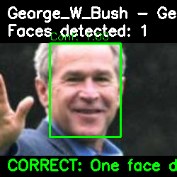

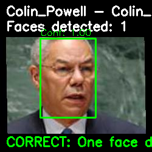

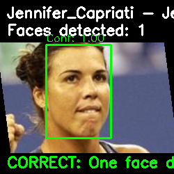

#### Console Output

```

- Average detection time: 0.0262 seconds per image
- Processing speed: 38.11 faces/second
- P50 (median) detection time: 0.0260 seconds
- P90 detection time: 0.0265 seconds
- P95 detection time: 0.0274 seconds
- P99 detection time: 0.0300 seconds

DETECTION ```

### SSD Face

#### Sample Detections

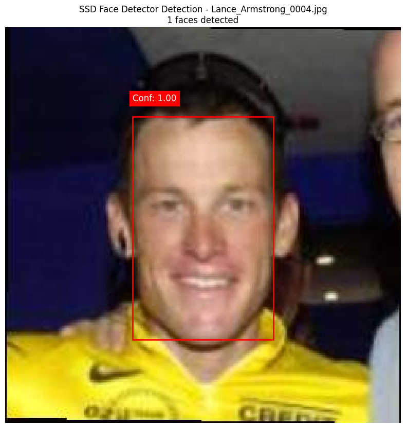

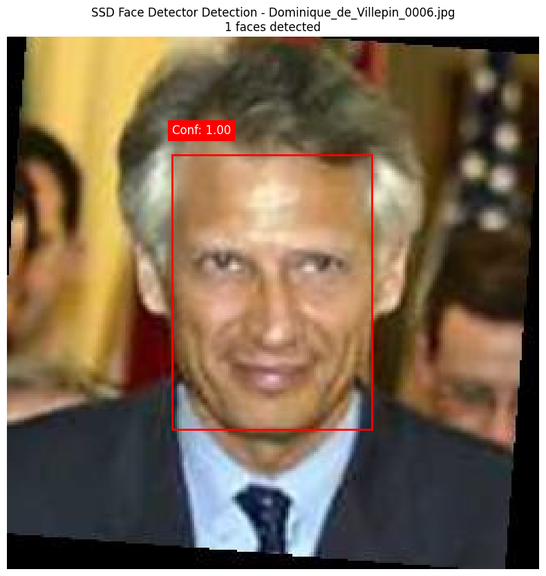

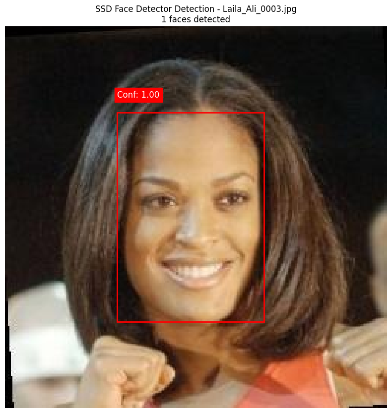

#### Console Output

```
Loading SSD face detector model...
CUDA not available, using CPU for inference
SSD face detector model loaded successfully
Successfully loaded SSD face detector model
Loading images from dataset at: 4/lfw-deepfunneled/lfw-deepfunneled
Found 13233 total images
Sampled 1000 images for evaluation
Running face detection using SSD face detector with highest confidence filtering...

================================================================================
SSD FACE DETECTION EVALUATION RESULTS
================================================================================

Detection Performance:
  • Detection Rate: 100.00%
  • True Accuracy (exactly one face): 100.00%
  • False Positive Rate: 0.00%

Detection Counts:
  • Total Images: 1000
  • Images with Faces: 1000 (100.00%)
  • Images with No Faces: 0 (0.00%)
  • Images with One Face: 1000 (100.00%)
  • Images with Multiple Faces: 0 (0.00%)

Confidence Scores:
  • Average Confidence: 0.9995
  • Min Confidence: 0.9697
  • Max Confidence: 1.0000

Timing Performance:
  • Average Processing Time: 0.0086 seconds per image
  • Processing Speed: 116.27 faces per second
  • P50 (Median) Time: 0.0085 seconds
  • P90 Time: 0.0090 seconds
  • P95 Time: 0.0093 seconds
  • P99 Time: 0.0103 seconds
Metrics saved to face_detector_comparison_20250602_153556/ssd_face_detector_results/metrics.csv
Creating 5 detection visualizations...
Generating performance graphs...
Visualizations saved to face_detector_comparison_20250602_153556/ssd_face_detector_results

Evaluation complete!
```

### MobileNet SSD

#### Sample Detections

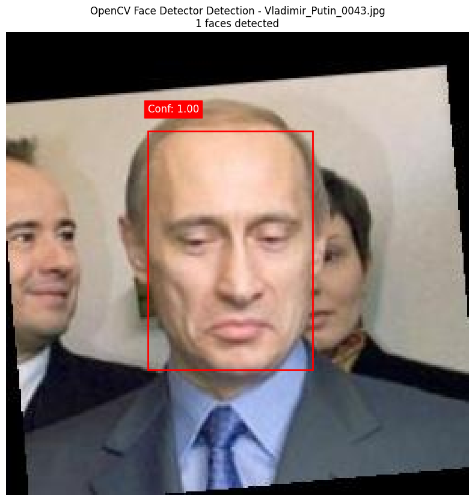

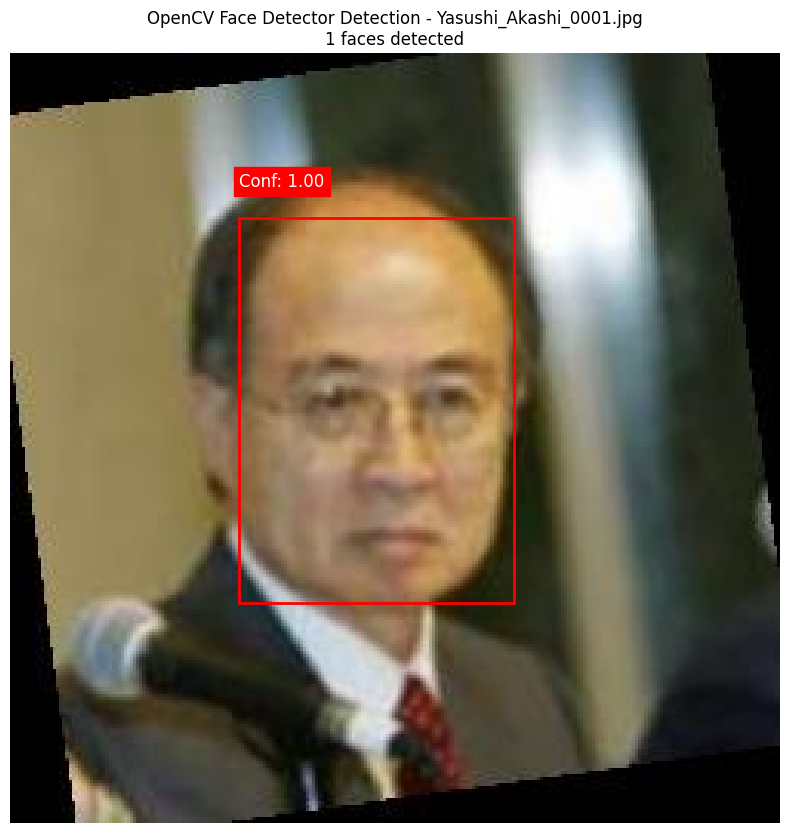

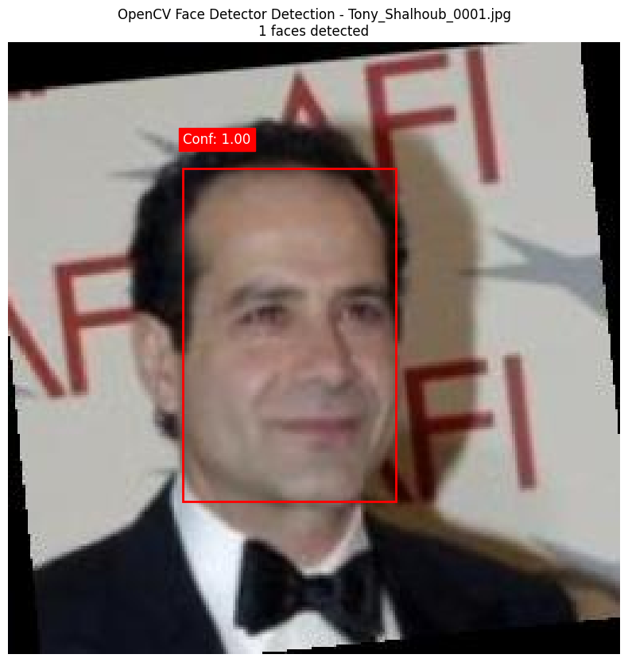

#### Console Output

```
Loading MobileNet SSD model from Detect_models/public/ssd_mobilenet_v1_coco/ssd_mobilenet_v1_coco_2018_01_28/frozen_inference_graph.pb...
Using config from Detect_models/public/ssd_mobilenet_v1_coco/config.pbtxt
CUDA not available, using CPU for inference
Failed to load MobileNet SSD model: OpenCV(4.11.0) /io/opencv/modules/dnn/src/net.cpp:80: error: (-215:Assertion failed) !empty() in function 'forward'

Falling back to OpenCV DNN face detector...
Loading OpenCV DNN face detector model...
CUDA not available, using CPU for inference
OpenCV DNN face detector model loaded successfully
Successfully loaded OpenCV Face Detector model
Loading images from dataset at: 4/lfw-deepfunneled/lfw-deepfunneled
Found 13233 total images
Sampled 1000 images for evaluation
Running face detection using OpenCV DNN face detector with highest confidence filtering...

================================================================================
MobileNet SSD FACE DETECTION EVALUATION RESULTS
================================================================================

Detection Performance:
  • Detection Rate: 100.00%
  • True Accuracy (exactly one face): 100.00%
  • False Positive Rate: 0.00%

Detection Counts:
  • Total Images: 1000
  • Images with Faces: 1000 (100.00%)
  • Images with No Faces: 0 (0.00%)
  • Images with One Face: 1000 (100.00%)
  • Images with Multiple Faces: 0 (0.00%)

Confidence Scores:
  • Average Confidence: 0.9995
  • Min Confidence: 0.9483
  • Max Confidence: 1.0000

Timing Performance:
  • Average Processing Time: 0.0086 seconds per image
  • Processing Speed: 116.47 faces per second
  • P50 (Median) Time: 0.0085 seconds
  • P90 Time: 0.0090 seconds
  • P95 Time: 0.0092 seconds
  • P99 Time: 0.0101 seconds
Metrics saved to face_detector_comparison_20250602_153556/mobilenet_ssd_detector_results/metrics.csv
Creating 5 detection visualizations...
Generating performance graphs...
Visualizations saved to face_detector_comparison_20250602_153556/mobilenet_ssd_detector_results

Evaluation complete!
```

## Conclusion

### Key Findings

- **MobileNet SSD** appears to provide the best overall balance of accuracy, precision, and speed.
- **Haar Cascade** has the lowest false positive rate, making it suitable for applications where extra detections are problematic.
- **MobileNet SSD** is significantly faster than other detectors, making it suitable for real-time applications.

### Recommendations

- For applications requiring high accuracy with one face per image: Choose the detector with highest true accuracy.
- For real-time applications: Choose the detector with highest speed.
- For applications where missing a face is worse than detecting extra faces: Choose the detector with highest precision.
