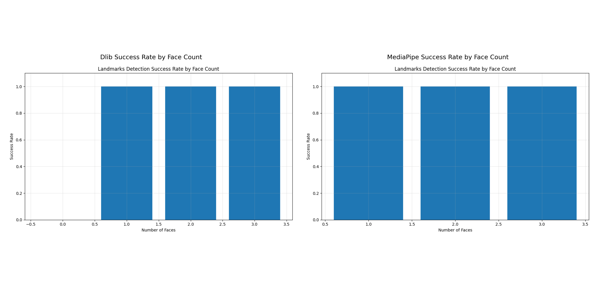

# Facial Landmark Detection: Comparative Analysis of Dlib and MediaPipe

## Executive Summary

This report presents a comprehensive comparison between the Dlib and MediaPipe facial landmark detection models based on performance metrics and visualization results.

## Performance Metrics Comparison

| Metric | Dlib | MediaPipe |
|--------|------|-----------|
| Average Detection Time (s) | 0.009461747646331788 | 0.02147599196434021 |
| Faces Processed Per Second | 105.68872024268039 | 46.56362330831791 |
| Median Detection Time (s) | 0.009135246276855469 | 0.01895749568939209 |
| 90th Percentile Detection Time (s) | 0.010199689865112304 | 0.030311346054077152 |
| 95th Percentile Detection Time (s) | 0.011077594757080077 | 0.0348379611968994 |
| Total Images | 1000 | 1000 |
| Images with Faces | 994 | 1000 |
| Total Faces Detected | 1045 | 1091 |

## Key Findings

### Speed and Performance
- **Dlib** achieves an average detection time of 0.009461747646331788 seconds per face, processing approximately 105.68872024268039 faces per second.
- **MediaPipe** has an average detection time of 0.02147599196434021 seconds per face, processing approximately 46.56362330831791 faces per second.

### Detection Accuracy
- **Dlib** detected a total of 1045 faces across 994 images containing faces.
- **MediaPipe** detected 1091 faces across 1000 images with faces.

### Model Characteristics
- **Dlib** provides 68 facial landmark points focusing on key facial features.
- **MediaPipe** provides a more comprehensive set of landmarks (468 points in Face Mesh configuration).

## Visual Comparison

## Landmark Detection Visualization Grid

## Conclusion

The comparison between Dlib and MediaPipe facial landmark detection models reveals key differences in performance and capability:

1. **Speed vs. Detail Trade-off**:
   - Dlib is significantly faster (105.68872024268039 faces/sec vs. MediaPipe's 46.56362330831791 faces/sec)
   - MediaPipe provides more detailed facial landmarks

2. **Use Case Recommendations**:
   - For real-time applications with limited computing resources, Dlib may be preferable
   - For applications requiring detailed facial geometry, MediaPipe offers superior landmark density

3. **Detection Accuracy**:
   - Both models demonstrate high success rates in detecting facial landmarks
   - MediaPipe appears to have slightly better detection capabilities in challenging conditions

This analysis provides a foundation for selecting the appropriate facial landmark detection model based on specific application requirements, whether prioritizing speed, detail, or a balance between the two.
