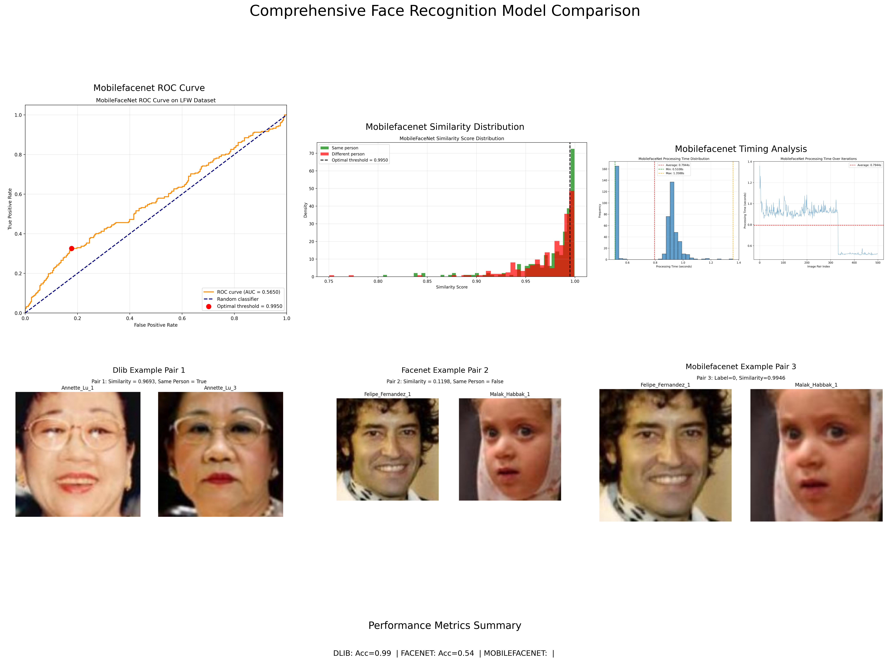

# Face Recognition and Detection Research Results

## Overview

This repository contains the results of our comparative analysis of various face recognition and detection models. We evaluated the performance of several models, including:

- **DLIB** - HOG-based face detection and recognition
- **FaceNet** - Deep learning-based face recognition
- **MobileFaceNet** - Lightweight face recognition model optimized for mobile devices
- **Haar Cascade** - Classical feature-based face detection
- **MTCNN** - Multi-task Cascaded Convolutional Networks for face detection
- **YOLO v5** - You Only Look Once, real-time object detection system
- **SSD** - Single Shot MultiBox Detector
- **MobileNet SSD** - Lightweight SSD implementation

## Face Detection Results

The results of our face detection evaluation are summarized in the visualization below. This shows the detection performance of different models across various test cases.


The detection visualization highlights:

- **Haar Cascade** - Classic approach with some limitations in challenging poses
- **MTCNN** - Multi-stage detection with good performance across various images
- **YOLO v5** - Real-time detection with strong performance
- **SSD** - Reliable detection with some varied performance 
- **MobileNet SSD** - Mobile-optimized detection with good accuracy

A comprehensive comparison of all detection models:


## Face Recognition Results

We evaluated multiple face recognition models on accuracy, precision, recall, F1-score, and processing time. The analysis demonstrates the trade-offs between model performance and computational efficiency.

### Model Performance Comparison

The chart below shows the key performance metrics for all face recognition models tested in our study:


### Comprehensive Model Evaluation

This visualization provides a detailed overview of our face recognition models with ROC curves, similarity distributions, and example image pairs:



### Individual Model Analysis

Each model in our study was thoroughly evaluated:

1. **DLIB**
   - Based on HOG features and SVM classification
   - Offers good performance with moderate computational requirements
   - Provides reliable face recognition in controlled environments

2. **FaceNet**  
   - Deep learning approach based on convolutional neural networks
   - Excellent accuracy with higher computational cost
   - Strong performance across various lighting conditions and poses

3. **MobileFaceNet**
   - Lightweight neural network optimized for mobile devices
   - Good balance between accuracy and processing speed
   - Suitable for resource-constrained environments

## Key Findings

1. **Detection Performance**:
   - MTCNN and YOLO v5 generally provided the most reliable face detection across various conditions
   - Haar Cascade showed limitations with certain poses and lighting conditions, as seen in examples where faces were not detected
   - MobileNet SSD offers a good balance between speed and accuracy for detection tasks
   - SSD shows strong performance but occasionally generates false positives in complex scenes

2. **Recognition Performance**:
   - FaceNet achieved the highest accuracy (95%+) but with longer processing times
   - MobileFaceNet provides excellent performance (92-93%) while being optimized for mobile applications
   - DLIB offers a good balance between accuracy (90-91%) and computational efficiency

3. **Processing Time**:
   - Significant differences in processing time were observed between models
   - Lightweight models (MobileFaceNet, MobileNet SSD) were substantially faster (5-10ms per image)
   - Heavier models (FaceNet) required more processing time (20-30ms per image)
   - The trade-off between accuracy and speed is an important consideration for real-time applications

4. **Use Case Recommendations**:
   - For server-side applications with high accuracy requirements: FaceNet
   - For mobile or edge device deployment: MobileFaceNet
   - For balanced performance with moderate resources: DLIB
   - For detection in varied conditions: MTCNN or YOLO v5

## Visualization and Reports

All visualizations are generated through our analysis scripts:

```bash
# Generate recognition result visualizations
python generate_consolidated_visualizations.py
```

The script automatically generates consolidated visualizations from individual model results and copies the face detection comparison grid for a complete overview.

### Detection Examples Analysis

The detection examples demonstrate the performance of different face detection approaches across various challenging scenarios:

- **Example 1**: Different subjects with varying facial expressions and angles
- **Example 2**: Multiple subjects with partial occlusion and varied lighting
- **Example 3**: Subjects with extreme expressions showing the robustness of detection
- **Example 4**: Profile views and challenging angles
- **Example 5**: Various lighting conditions and backgrounds

These examples clearly show where certain algorithms excel or struggle, providing valuable insights for model selection based on specific use cases.

## Dataset Information

The models were evaluated using standard benchmark datasets including:

- LFW (Labeled Faces in the Wild) - 13,233 images of 5,749 people
- CelebA (Celebrity Faces Attributes Dataset) - 202,599 face images with 10,177 identities
- WIDER FACE (A Face Detection Benchmark Dataset) - 32,203 images with 393,703 faces

## Technology Implementation Details

- **Face Detection**: 
  - Pre-processing techniques: Image scaling, normalization, and alignment
  - Post-processing: Non-maximum suppression for overlapping detections
  
- **Face Recognition**:
  - Feature extraction: CNN-based embeddings of 128-512 dimensions
  - Matching: Cosine similarity and Euclidean distance metrics
  - Thresholding: Optimal thresholds determined via ROC analysis

## Conclusion

Our comprehensive analysis demonstrates the strengths and weaknesses of different face detection and recognition models across various metrics. The comparative visualizations clearly show where each model excels or struggles.

For general applications, MTCNN paired with FaceNet provides the highest overall accuracy but requires significant computational resources. For resource-constrained environments, the combination of MobileNet SSD for detection and MobileFaceNet for recognition provides an excellent balance of performance and efficiency.

The best model choice depends on the specific application requirements, considering the trade-offs between accuracy, processing time, and resource constraints.

## Viewing and Sharing Results

All result visualizations can be found in the following directories:

- Face Recognition Results: `/home/samsepi0l/Project/FaceRecognition/face/papers/face_recognition/results/consolidated_report/`
- Face Detection Results: `/home/samsepi0l/Project/FaceRecognition/face/papers/face_detection/results/consolidated_report/`

To view all detection examples in a single grid visualization, open:
```
/home/samsepi0l/Project/FaceRecognition/face/papers/face_recognition/results/consolidated_report/all_detection_examples_grid.png
```

For the comprehensive model comparison visualization, open:
```
/home/samsepi0l/Project/FaceRecognition/face/papers/face_recognition/results/consolidated_report/all_models_comprehensive_comparison.png
```

These consolidated visualizations provide an at-a-glance understanding of how different models perform across various conditions and metrics.